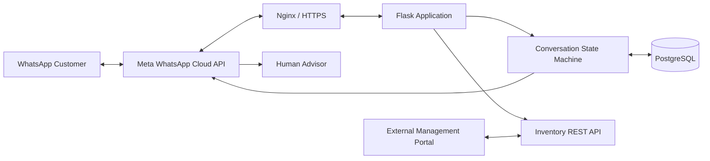

# WhatsApp Business Chatbot for a Craft Brewery

[](https://www.python.org/)
[](https://flask.palletsprojects.com/)
[](https://www.postgresql.org/)
[](https://developers.facebook.com/docs/whatsapp/cloud-api/)

A production-oriented WhatsApp chatbot built with **Python, Flask, PostgreSQL, and the Meta WhatsApp Cloud API** to automate customer service for a craft brewery.

The project handles common customer interactions such as opening hours, reservations, product browsing, order capture, portfolio delivery, and handoff to a human advisor. It also exposes a small authenticated REST API so inventory can be managed from an external brewery management application.

> This repository is a portfolio project based on a real operational use case at **Cervecería Libre** in Medellín, Colombia.

## Highlights

- Meta WhatsApp Cloud API webhook integration
- Interactive WhatsApp lists and reply buttons
- Stateful multi-step conversation flows
- Product availability and real-time stock validation
- Automatic inventory deduction when an order is completed
- Reservation workflow with structured data collection
- Human-advisor handoff using approved Utility message templates
- PDF portfolio delivery through WhatsApp
- Support for both phone-number recipients and WhatsApp Business-Scoped User IDs (BSUID)
- Customer phone / username fallback for advisor contact information
- PostgreSQL persistence with SQLAlchemy and Flask-Migrate
- API-key protected REST API for product and inventory management
- Local webhook simulator and test scripts for development

## Customer Flow

The current main menu is:

```text
1. Opening hours
2. Reservations
3. Products and orders
4. Portfolio
5. Talk to an advisor
```

### Opening hours

Business hours are stored outside the Python flow logic in a simple content file, making operational updates possible without changing the chatbot code.

### Reservations

Reservations are collected as a guided conversation instead of free-form text:

```text
Location
  ↓
Date
  ↓
Time
  ↓
Customer name
  ↓
Number of guests
  ↓
Utility template notification to advisor
```

### Products and orders

The bot only presents active products with stock greater than zero. Customers select products through an interactive WhatsApp list, enter quantities, and can continue adding products before finalizing the order.

```text
Product list
   ↓
Select product
   ↓
Enter quantity
   ↓
Validate current stock
   ↓
Add another / Finish
   ↓
Delivery information
   ↓
Revalidate stock
   ↓
Deduct inventory
   ↓
Notify advisor
```

Stock is checked again before final confirmation to reduce the risk of overselling when multiple customers order concurrently.

### Human handoff

Requests that need manual attention are sent to an advisor using approved WhatsApp **Utility templates**. The notification prefers the customer's real WhatsApp phone number and falls back to the WhatsApp username when Meta does not expose the number.

## Architecture



## Project Structure

```text
whatsapp-bot/
├── app/
│   ├── __init__.py
│   ├── config.py
│   ├── models.py
│   ├── content/
│   │   └── horarios.txt
│   ├── routes/
│   │   ├── webhook.py
│   │   └── products_api.py
│   └── services/
│       ├── auth_service.py
│       ├── bot_service.py
│       └── whatsapp_service.py
├── migrations/
├── public/
├── scripts/
│   ├── seed_products.py
│   ├── test_advisor.py
│   └── test_send.py
├── .env.example
├── requirements.txt
└── run.py
```

## Data Model

The database includes models for:

- `Customer`
- `Product`
- `Conversation`
- `Message`
- `Order`
- `OrderItem`
- `BarLocation`
- `Reservation`
- `Payment`

The current chatbot actively uses customer, product, conversation, and message persistence. Additional order, reservation, payment, and ERP-related fields provide the foundation for later automation stages.

## Tech Stack

| Component | Technology |
|---|---|
| Backend | Python 3.12, Flask 3.1 |
| ORM | SQLAlchemy / Flask-SQLAlchemy |
| Database | PostgreSQL |
| Migrations | Alembic / Flask-Migrate |
| Messaging | Meta WhatsApp Cloud API |
| HTTP client | Requests |
| WSGI server | Gunicorn |
| Reverse proxy | Nginx |
| Configuration | python-dotenv |

## Local Setup

### 1. Clone the repository

```bash
git clone git@github.com:afosorioh/whatsapp-bot.git
cd whatsapp-bot
```

### 2. Create a virtual environment

```bash
python3 -m venv venv
source venv/bin/activate
```

### 3. Install dependencies

```bash
python -m pip install --upgrade pip
pip install -r requirements.txt
```

### 4. Configure environment variables

```bash
cp .env.example .env
```

Configure the following values in `.env`:

```env
SECRET_KEY=

DB_HOST=
DB_NAME=
DB_USER=
DB_PASSWORD=

FLASK_APP=run.py
FLASK_ENV=development

WHATSAPP_ACCESS_TOKEN=
WHATSAPP_PHONE_NUMBER_ID=
WHATSAPP_BUSINESS_ACCOUNT_ID=
WHATSAPP_GRAPH_VERSION=v23.0
WHATSAPP_VERIFY_TOKEN=

ADVISOR_WHATSAPP_NUMBER=
ADVISOR_TEMPLATE_NAME=
ADVISOR_TEMPLATE_LANGUAGE=es

ORDER_TEMPLATE_NAME=
ORDER_TEMPLATE_LANGUAGE=es

RESERVATION_TEMPLATE_NAME=
RESERVATION_TEMPLATE_LANGUAGE=es

PORTFOLIO_PDF_URL=
CHATBOT_API_KEY=
```

Never commit the real `.env` file or production credentials.

### 5. Create the PostgreSQL database

Example:

```sql
CREATE DATABASE whatsapp_bot;
CREATE USER whatsapp_bot_user WITH PASSWORD 'change-this-password';
GRANT ALL PRIVILEGES ON DATABASE whatsapp_bot TO whatsapp_bot_user;
```

Set the matching values in `.env`.

### 6. Run database migrations

```bash
flask --app run.py db upgrade
```

### 7. Run the application

Development:

```bash
flask --app run.py run --host 127.0.0.1 --port 5000
```

Production example:

```bash
gunicorn --workers 2 --bind 127.0.0.1:8001 run:app
```

## Meta WhatsApp Configuration

The webhook endpoint is:

```text
GET  /chatbot/webhook   # Meta verification
POST /chatbot/webhook   # Incoming messages and delivery statuses
```

A typical public callback URL behind Nginx is:

```text
https://your-domain.example/chatbot/webhook
```

Configure the same value used in `WHATSAPP_VERIFY_TOKEN` when registering the webhook in Meta.

The application currently processes:

- text messages
- interactive list replies
- interactive button replies
- outgoing message status notifications
- phone-number based users
- Business-Scoped User IDs (`CO.xxxxx`)

## Local Webhook Simulation

The project includes a simulator that allows conversation logic to be tested without sending a real WhatsApp message:

```bash
curl -X POST http://127.0.0.1:5000/chatbot/simulate-message \
  -H "Content-Type: application/json" \
  -d '{
    "phone": "573001112233",
    "message": "hola",
    "username": "testuser",
    "profile_name": "Test User"
  }'
```

## Inventory REST API

The application exposes an API-key protected product API under:

```text
/chatbot/api
```

Available endpoints:

| Method | Endpoint | Description |
|---|---|---|
| `GET` | `/chatbot/api/products` | List products |
| `GET` | `/chatbot/api/products/<id>` | Get one product |
| `POST` | `/chatbot/api/products` | Create product |
| `PUT` | `/chatbot/api/products/<id>` | Update product |
| `PATCH` | `/chatbot/api/products/<id>/stock` | Update stock |
| `DELETE` | `/chatbot/api/products/<id>` | Soft-delete / deactivate product |

Requests must include:

```http
X-API-Key: <CHATBOT_API_KEY>
```

Example:

```bash
curl https://your-domain.example/chatbot/api/products?active=true \
  -H "X-API-Key: $CHATBOT_API_KEY"
```

This API allows the WhatsApp inventory to be managed by a separate brewery administration portal without coupling both Flask applications to the same database.

## WhatsApp Templates

The production workflow uses approved Utility templates for internal advisor notifications, including:

- general advisor requests
- completed order notifications
- reservation notifications

Template names and language codes are configured through environment variables rather than hard-coded in the application.

## Security Notes

- Production credentials are read from environment variables.
- Inventory API endpoints require an API key.
- The PostgreSQL database is not exposed directly to the management portal.
- The Flask application is intended to run behind HTTPS and a reverse proxy.
- Real Meta access tokens, API keys, database passwords, and verify tokens must never be committed.

## Production Deployment

The application is designed to run with:

```text
Internet
   ↓
HTTPS / Let's Encrypt
   ↓
Nginx
   ↓
Gunicorn
   ↓
Flask
   ↓
PostgreSQL
```

A `systemd` service can be used to keep Gunicorn running and restart the application after server reboots.

## Roadmap

Planned extensions include:

- Siigo ERP/POS customer lookup and synchronization
- persistent order lifecycle management
- Wompi payment-link / QR generation
- automatic payment-status processing
- paid-order notifications and delivery handoff
- improved observability and structured logging
- automated tests and CI
- multilingual customer flows

## Why This Project Matters

This project goes beyond a simple keyword chatbot. It combines messaging APIs, REST integration, stateful conversation design, inventory consistency, relational data modeling, deployment infrastructure, and human handoff into a real business workflow.

From a software engineering perspective, it demonstrates experience with:

- API integration
- webhook-driven architectures
- backend development with Flask
- relational modeling with PostgreSQL
- conversational state machines
- production deployment with Gunicorn and Nginx
- secure service-to-service APIs
- incremental automation of real operational processes

## Author

**Andrés Felipe Osorio**  
GitHub: [@afosorioh](https://github.com/afosorioh)

---

Built as a real-world automation project for Cervecería Libre.
